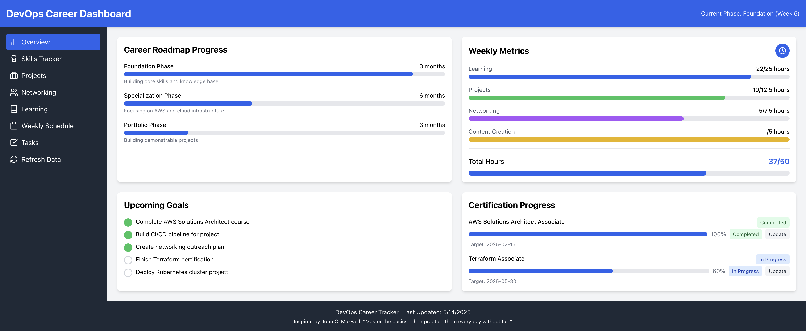
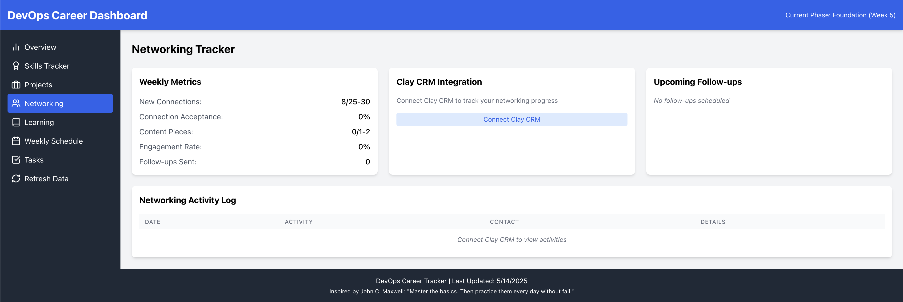
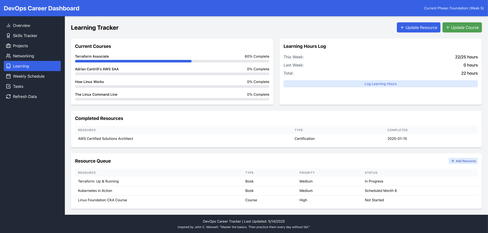

# DevOps Career Dashboard

A comprehensive dashboard for tracking your DevOps career progress, learning resources, and professional networking activities.



## Demo Available

A live demo of this dashboard is available at [devops-dashboard.joshuamichaelhall.com](https://devops-dashboard.joshuamichaelhall.com?demo=true). The demo version includes sample data showing approximately 90% career progress and is clearly marked as a demonstration.

## Additional Screenshots

### Networking Section


### Learning Resources


- **Live Demo**: [devops-dashboard.joshuamichaelhall.com](https://devops-dashboard.joshuamichaelhall.com?demo=true)
- **Project Page**: [joshuamichaelhall.com/dashboard](https://joshuamichaelhall.com/dashboard)
- **Development Article**: [Strategic Approach to DevOps Skills](https://joshuamichaelhall.com/blog/2025/05/20/strategic-approach-to-devops-skills)

## About this Project

This dashboard was created to help DevOps professionals and career transitioners monitor their progress, focus their learning efforts, and track career advancement metrics. It serves as both a productivity tool and a personal career development center.

### Key Features

- **Career Goal Tracking**: Monitor progress toward your DevOps career objectives
- **Learning Resource Management**: Track courses, tutorials, and certifications
- **Time Allocation Visualization**: Log and analyze how your time is spent
- **Networking Integration**: Connect with Clay CRM (optional) to track professional networking
- **Weekly Progress Metrics**: Visualize your productivity and achievements
- **Personalized Dashboard**: Configure the dashboard to focus on your specific career path

### Why Use This Dashboard

As DevOps roles continue to evolve, it's challenging to keep track of the many skills, tools, and practices needed to excel in the field. This dashboard provides:

- A central location for all career development activities
- Data-driven insights into your learning patterns
- Accountability through progress tracking
- Visualization of your DevOps journey

## Development Process with Claude.ai

This dashboard was built using Claude.ai's code assistance capabilities. The development process combined:

1. **Terminal-centric workflow**: Utilizing Claude in the terminal for real-time code generation
2. **AI-augmented development**: Leveraging Claude for architecture decisions and implementation
3. **Iterative refinement**: Starting with a basic framework and progressively enhancing functionality

The collaborative process between human direction and AI assistance allowed for rapid development while maintaining control over design decisions and implementation details.

### Development Approach

The dashboard was developed using a "vibe coding" approach:

1. Start with a clear vision of the desired outcome and user experience
2. Describe the functionality and architecture to Claude
3. Iterate through implementation together, with Claude handling code generation
4. Refine and test the code, providing feedback for improvements

This process dramatically accelerated development time while ensuring the final product aligned with the original vision.

## Technologies Used

- **Frontend**: React, TailwindCSS
- **Backend**: Node.js, Express
- **Data Storage**: JSON-based persistent storage with automatic backups
- **Authentication**: JWT-based auth with bcrypt password hashing
- **Security**: Helmet.js, rate limiting, encrypted storage for sensitive data
- **API Integration**: Clay CRM for networking (optional)

## Repository Structure

```
devops-career-dashboard/
├── dashboard/              # Main application code
│   ├── public/             # Static assets
│   ├── scripts/            # Utility scripts
│   ├── server/             # Server-side code
│   └── src/                # Frontend React code
│      ├── components/      # React components
│      ├── context/         # Context API state management
│      ├── data/            # Data storage
│      └── services/        # API services
├── docs/                   # Additional documentation
└── screenshots/            # Screenshots for documentation
```

## Installation & Setup

### Prerequisites

- Node.js 14+ and npm
- Git

### Installation Steps

1. Clone the repository:
   ```
   git clone https://github.com/joshuamichaelhall/devops-career-dashboard.git
   cd devops-career-dashboard/dashboard
   ```

2. Install dependencies:
   ```
   npm install
   ```

3. Create environment variables:
   ```
   cp .env.example .env
   ```

4. Set up security (required for production use):
   ```
   npm run secure-setup
   ```
   This will:
   - Generate a secure encryption key for API credentials
   - Create an admin user for dashboard access

5. Start the dashboard in development mode:
   ```
   npm run dev
   ```

6. For production:
   ```
   npm run build
   npm run start-prod
   ```

## Security Features

- **Authentication**: JWT-based authentication with secure password storage
- **API Key Protection**: Encrypted storage for sensitive API keys
- **HTTPS Enforcement**: Option to require HTTPS in production
- **Rate Limiting**: Protection against brute-force attacks
- **Input Validation**: Comprehensive validation on all API endpoints
- **Helmet.js**: HTTP header security
- **Access Controls**: Role-based permissions (admin/read-only)

### Privacy and Data Separation

This repository is designed with privacy in mind:

- **Your data stays private**: Personal dashboard data is not included in the repository
- **Environment variables**: All sensitive configuration is in `.env` files (excluded via `.gitignore`)
- **Owner-only updates**: Authentication ensures only you can update your own dashboard instance
- **Clean separation**: Others can fork/clone this repo without getting your personal information

When someone else uses this repository:
1. They'll get code without your personal data or API keys
2. They'll need to run `npm run setup-admin` to create their own admin account
3. They'll configure their own environment in `.env` file
4. They'll start with empty dashboard data that they populate themselves

See [PRIVACY.md](docs/PRIVACY.md) for detailed information about data ownership and privacy boundaries.

## Contributing

Contributions are welcome! Please see [CONTRIBUTING.md](CONTRIBUTING.md) for details on how to participate in this project.

## License

This project is licensed under the MIT License - see the [LICENSE](LICENSE) file for details.

## Acknowledgements

This project was built with assistance from [Claude.ai](https://claude.ai/), Anthropic's AI assistant. Claude helped with:
- Architecture design decisions
- Code generation and implementation
- Security considerations
- Documentation

Networking functionality optionally integrates with [Clay](https://clay.com/) for CRM capabilities.
